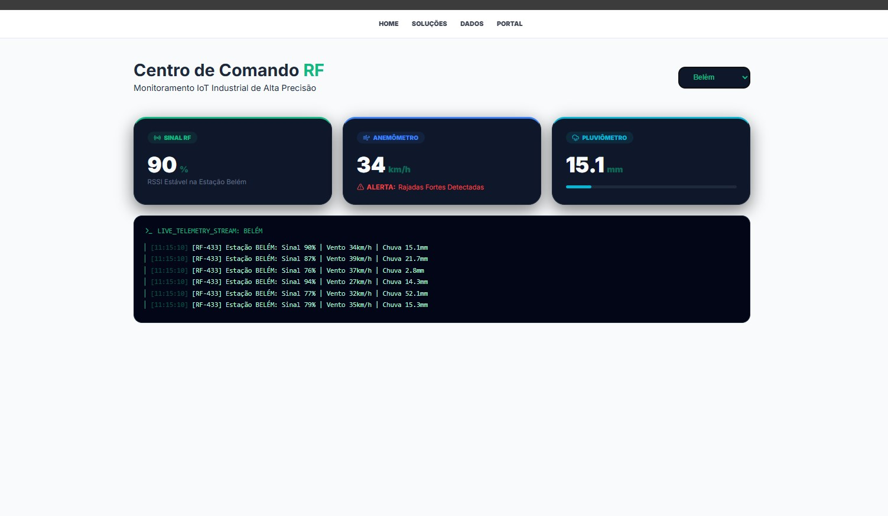
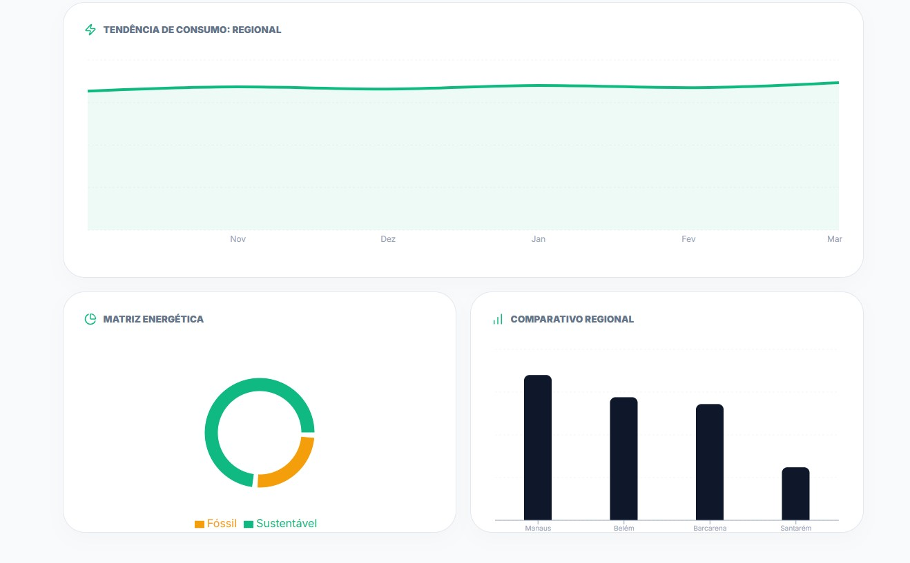
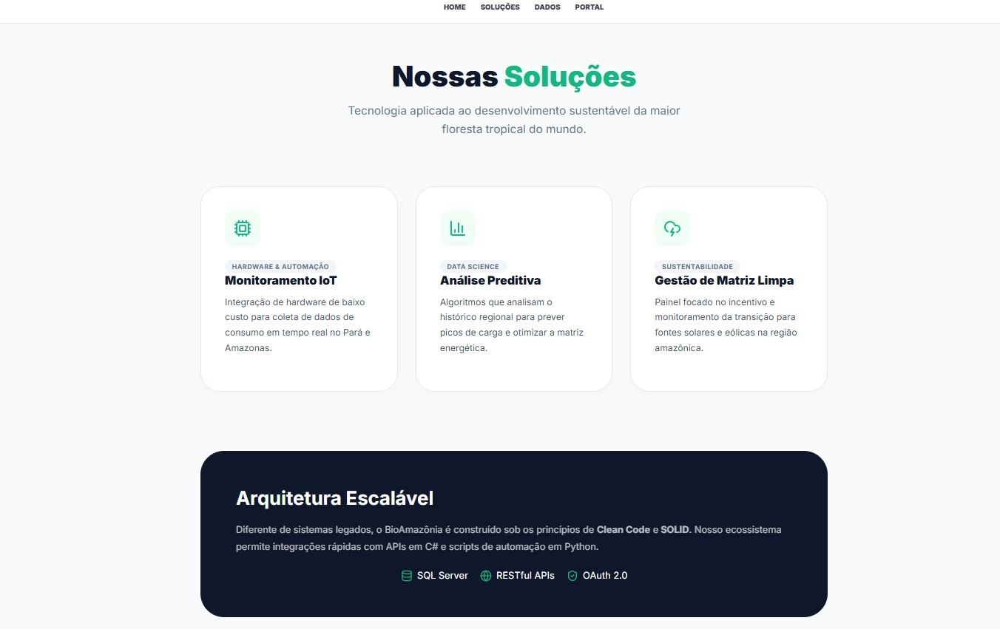

# 🌲 BioAmazônia - Smart IoT Monitoring

> **Dashboard industrial de telemetria em tempo real focado nos desafios climáticos e energéticos da Amazônia, com monitoramento especializado para Belém e Amazonas.**

---

## 📊 Demonstração Visual

### 📡 Centro de Comando RF
Monitoramento de alta precisão para rádio frequência (433MHz). O sistema detecta automaticamente rajadas de vento e volume de chuva, emitindo alertas de segurança industrial.

### 🗺️ Monitoramento Regional (Geolocalização)
Interface interativa com pins de status para diversas estações no Pará e Amazonas, fornecendo dados em tempo real sobre umidade e rede.

### 📈 Análise de Dados e Matriz Energética
Visualização de tendências de consumo e comparativo regional entre cidades como Manaus, Belém, Barcarena e Santarém.

### 💡 Nossas Soluções
Foco em Hardware IoT, Data Science para análise preditiva e gestão de matriz energética limpa para o desenvolvimento sustentável.

---

## 🛠️ Engenharia de Software e Arquitetura

Como formado em **Análise e Desenvolvimento de Sistemas** e atual estudante de **Engenharia de Software**, este projeto foi construído sob os seguintes pilares:

* **Clean Code & SOLID:** Arquitetura pensada para escalabilidade e manutenção simplificada.
* **Ecossistema Híbrido:** O frontend em React está preparado para integração com APIs robustas em **C#/.NET** e scripts de automação em **Python**.
* **Interface Industrial:** Design focado em "Dark Mode" para centros de operação, priorizando o contraste e a leitura rápida de alertas.

---

## 🚀 Como Executar

1.  **Clone o projeto:**
    `git clone https://github.com/JoaoFerr-Con/BioAmazonia-Dashboard.git`
2.  **Instale as dependências:**
    `npm install`
3.  **Inicie o ambiente de desenvolvimento:**
    `npm run dev`
